# Amazon_Vine_Analysis: By David Matheny:  Date 04/02/2022

# Deliverable 1: Perform ETL on Amazon Product Reviews

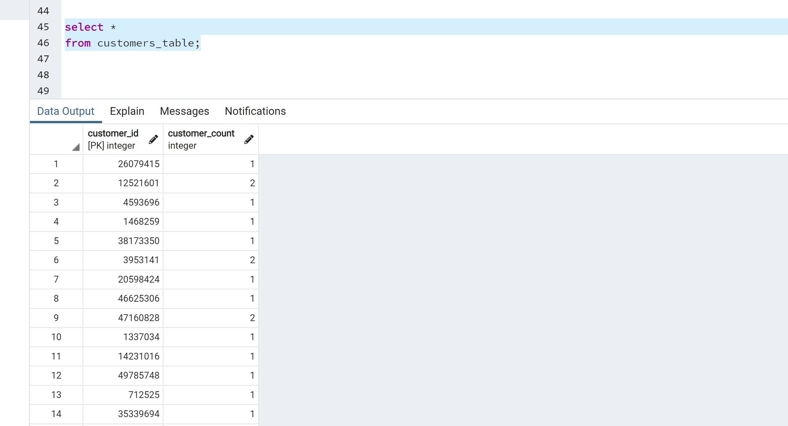

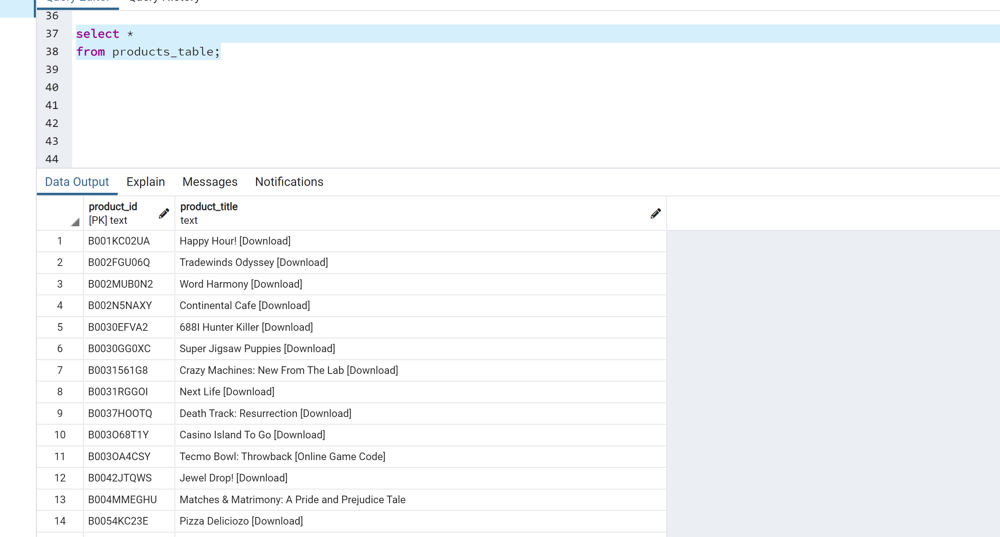

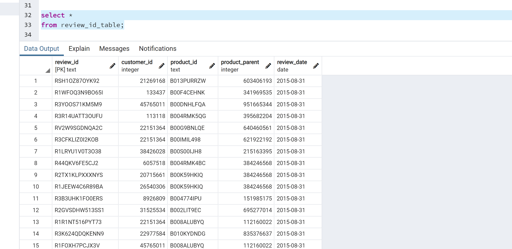

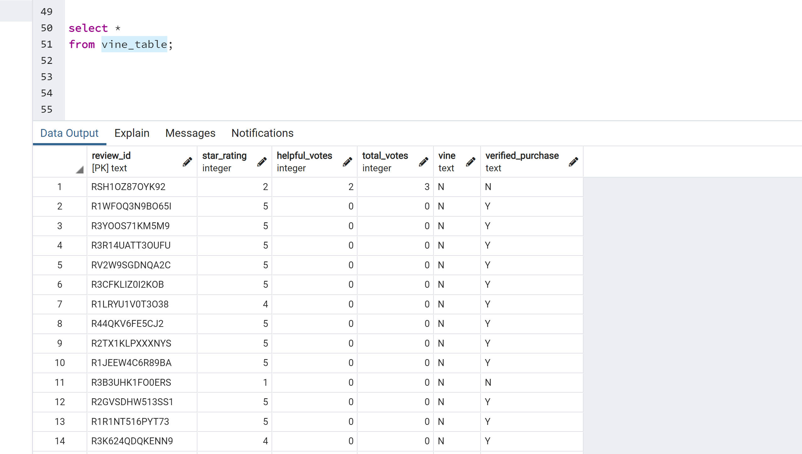

# Deliverable 2: Determine Bias of Vine Reviews
-Filter the data and create a new DataFrame or table to retrieve all the rows where the total_votes count is equal to or greater than 20 to pick reviews that are more likely to be helpful and to avoid having division by zero errors later on
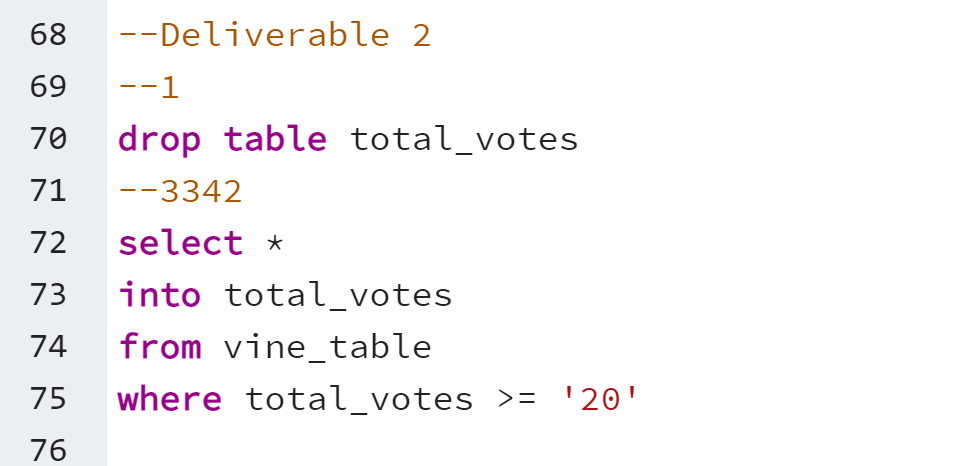

-Filter the new DataFrame or table created in Step 1 and create a new DataFrame or table to retrieve all the rows where the number of helpful_votes divided by total_votes is equal to or greater than 50%
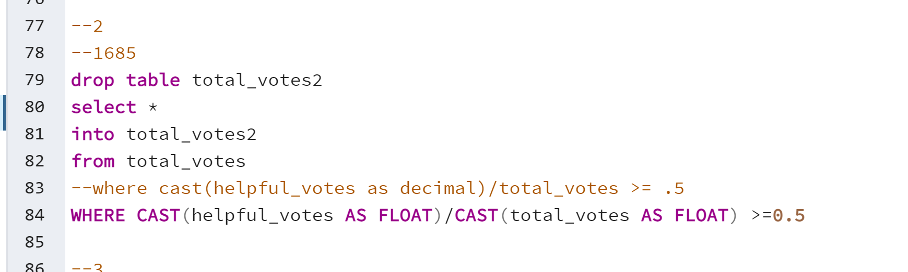

-Filter the DataFrame or table created in Step 2, and create a new DataFrame or table that retrieves all the rows where a review was written as part of the Vine program (paid), vine == 'Y'
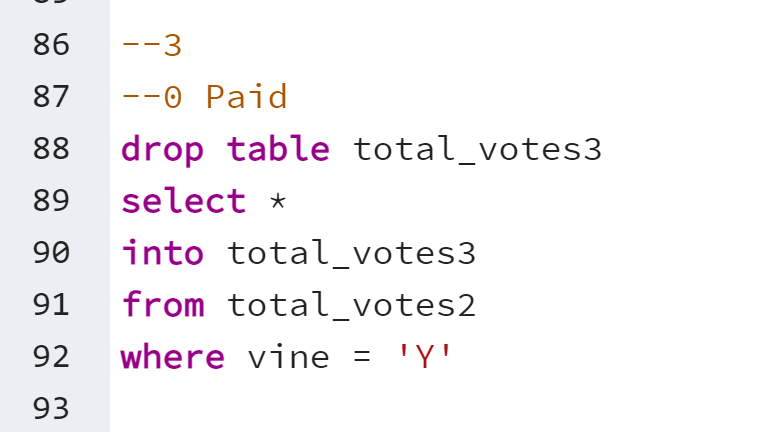

-Repeat Step 3, but this time retrieve all the rows where the review was not part of the Vine program (unpaid), vine == 'N'
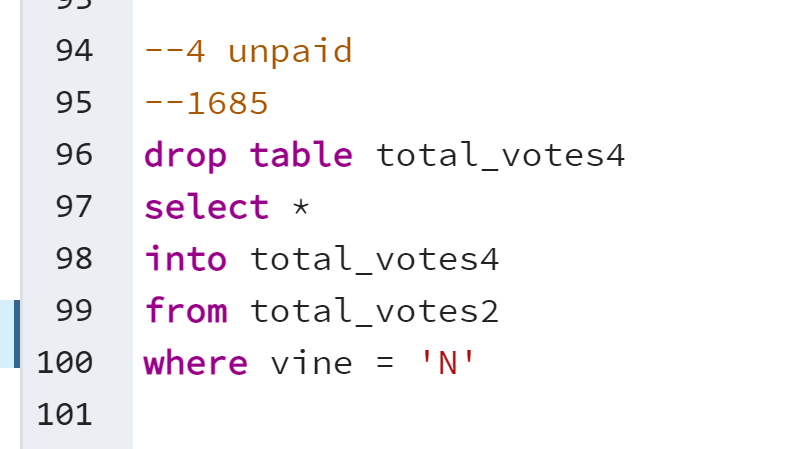

-Determine the total number of reviews
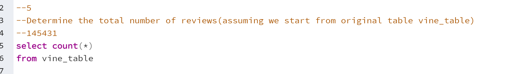

-The number of 5-star reviews
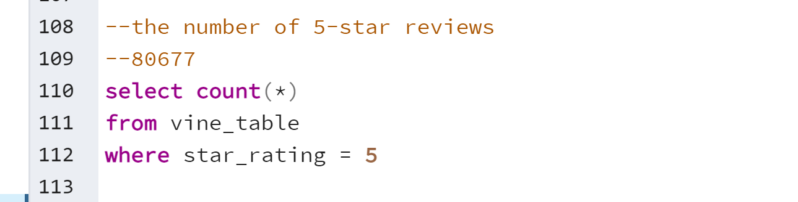

-Percentage of 5-star reviews Paid
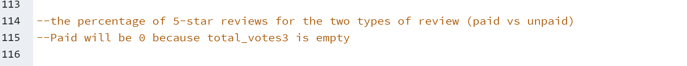

-Percentage of 5-star reviews Unpaid
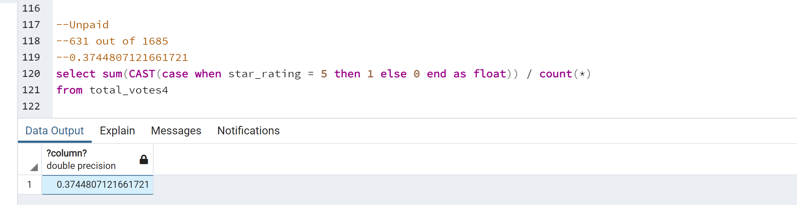

# Deliverable 3: A Written Report on the Analysis:  I used SQL instead of python
## Overview of the analysis: 
I've been tasked with the project: analyzing Amazon reviews written by members of the paid Amazon Vine program. The Amazon Vine program is a service that allows manufacturers and publishers to receive reviews for their products. Companies like SellBy pay a small fee to Amazon and provide products to Amazon Vine members, who are then required to publish a review.In this project, you’ll have access to approximately 50 datasets. Each one contains reviews of a specific product, from clothing apparel to wireless products. You’ll need to pick one of these datasets and use PySpark to perform the ETL process to extract the dataset, transform the data, connect to an AWS RDS instance, and load the transformed data into pgAdmin. Next, you’ll use PySpark, Pandas, or SQL to determine if there is any bias toward favorable reviews from Vine members in your dataset. Then, you’ll write a summary of the analysis for Jennifer to submit to the SellBy stakeholders.

Results:
How many Vine reviews and non-Vine reviews were there?  
After applying the criteria total_votes >= '20' and CAST(helpful_votes AS FLOAT)/CAST(total_votes AS FLOAT) >=0.5 There were 0 Paid and 1685 unpaid.

How many Vine reviews were 5 stars? 
This is a poorly written question, I have to make assumptions which I hate to do.  Assuming they meant how many 5 star reviews where vine = 'Y' based and on the prior filters(total_votes >= '20' and CAST(helpful_votes AS FLOAT)/CAST(total_votes AS FLOAT) >=0.5), if this is the case then the answer is 0

How many non-Vine reviews were 5 stars?
This is a poorly written question, I have to make assumptions which I hate to do.  Assuming they meant how many 5 star reviews where vine = 'N' based and on the prior filters(total_votes >= '20' and CAST(helpful_votes AS FLOAT)/CAST(total_votes AS FLOAT) >=0.5), if this is the case then the answer is 1685

What percentage of Vine reviews were 5 stars? 
This is a poorly written question, I have to make assumptions which I hate to do.  Assuming they meant how many 5 star reviews where vine = 'Y' based and on the prior filters(total_votes >= '20' and CAST(helpful_votes AS FLOAT)/CAST(total_votes AS FLOAT) >=0.5), if this is the case then the answer is 0% percent

What percentage of non-Vine reviews were 5 stars?
This is a poorly written question, I have to make assumptions which I hate to do.  Assuming they meant how many 5 star reviews where vine = 'N' based and on the prior filters(total_votes >= '20' and CAST(helpful_votes AS FLOAT)/CAST(total_votes AS FLOAT) >=0.5), if this is the case then the answer is 37% percent

Summary:
I believe the dataset is way too small to draw any conclusions.  To get only 0% paid and 37% unpaid, it would tell me that unpaid has a bias.  But since were are working with such a small amount of data after our filters(total_votes >= '20' and CAST(helpful_votes AS FLOAT)/CAST(total_votes AS FLOAT) >=0.5) I wouldnt make any assumptions until we either adjusted our filters or added way more data.  I would back this up with our data starting off with 145431 records and then filtering them down to 1685, thats just too small for accurate analysis.